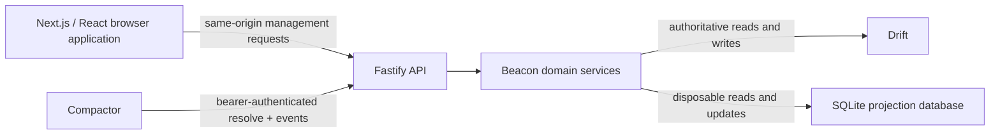

# Beacon architecture

Use this page when changing a system boundary, HTTP contract, persistence flow, security control, or deployment topology. It explains why Beacon delegates durable storage to Drift and redirect execution to Compactor, and identifies the decisions automation must not infer.

Beacon is the management boundary between Drift and Compactor. It is a single-tenant, single-administrator, single-replica application in v0.1.0.

**Guaranteed** statements below describe Beacon's implemented v0.1.0 contract. **Adapter-specific** statements describe the current Drift or SQLite implementation and are not promises that another adapter would preserve. **Recommended** deployment choices require explicit operator approval.

## Ownership and workspace boundaries

| Boundary          | Owns                                                                                       | Does not own                                                                |
| ----------------- | ------------------------------------------------------------------------------------------ | --------------------------------------------------------------------------- |
| `packages/shared` | Runtime-validated transport contracts and cross-runtime types                              | Persistence, credentials, or browser behavior                               |
| `packages/server` | Configuration, sessions, Drift gateway, domain rules, Compactor endpoints, and projections | Redirect execution or authoritative local copies                            |
| `apps/web`        | Browser interaction, navigation, forms, and presentation                                   | Drift keys, Compactor tokens, or authorization decisions                    |
| Drift             | IDs, tenant isolation, versions, timestamps, soft deletion, and durable vertices/edges     | Beacon's UI or Compactor runtime behavior                                   |
| Compactor         | Redirect execution, cache behavior, and event production                                   | Beacon management data or durable event delivery                            |
| SQLite            | Search, canonical resolution lookup, activity rows, event rows, and projection state       | Authoritative redirect, destination, credential, event, or activity records |

Do not move these responsibilities for convenience. In particular, an operator must configure tenant mapping, proxy trust, cache policy, redirect destinations, archival intent, and all secrets; Beacon must not infer them.

## Request and persistence lifecycles

### Browser management

The Next.js App Router produces a static React application. Fastify serves that exported application in production. In development, Next proxies `/api/*` and `/integrations/*` to Fastify and falls back to the browser entry route for client editor paths.

Browser sessions are signed, expiring, HTTP-only, same-site cookies. Management mutations require an authenticated session and reject cross-origin submissions when an `Origin` header is present. When an operator configures `BEACON_BROWSER_ORIGIN`, Beacon accepts only that exact browser origin; otherwise it requires the origin host to match the request host. Its scheme also controls the session cookie transport flag: HTTPS origins receive `Secure` cookies, while an explicitly configured HTTP origin supports local development. An unset origin keeps the production `Secure` default. This keeps the local Next.js development proxy explicit without trusting forwarded headers or silently weakening a deployed HTTPS session. Versioned redirect and destination writes surface Drift conflicts as `409`; callers must reload the current record instead of retrying a blind overwrite.

### Authoritative mutation and projection update

1. Fastify validates the request at the HTTP boundary.
2. The domain service validates lifecycle and URL/header rules and writes the authoritative change to Drift.
3. The service persists the corresponding immutable management activity vertex in Drift.
4. The service updates SQLite search, resolution, activity, or report rows.
5. If step 4 fails, the Drift mutation remains successful and the projection becomes stale. An operator rebuilds it from Drift.

The ordering is an invariant: a local projection failure never rolls back or obscures a durable Drift result. Drift does not currently offer Beacon an atomic multi-record mutation, so a resource write and its activity entry can be durably separate; callers must not assume the activity log is a transaction boundary.

### Compactor resolution

1. Compactor sends a canonical source URL and the source bearer credential to `GET /integrations/compactor/v1/resolve`.
2. Beacon uses SQLite only to find a candidate redirect ID.
3. Beacon rereads the redirect vertex, its `points_to` edge, and its destination from Drift and validates the resulting Compactor definition.
4. Beacon returns the exact definition, an authoritative `404` for missing/disabled/archived state, or an error for an unavailable/invalid authoritative graph.
5. On a projection miss, Beacon scans Drift and self-heals the lookup before deciding that the redirect is absent.

The projection-plus-authoritative-read flow is a bounded v0.1.0 workaround for Drift's current lookup and aggregation limits. It trades an occasional scan for a disposable local index without treating that index as truth.

### Compactor event ingestion

Compactor sends a strict, bearer-authenticated event object to `POST /integrations/compactor/v1/events`. Beacon accepts it only after runtime validation, writes the immutable event vertex to Drift, then updates local event reporting. A `204` means Drift persistence succeeded. Duplicate `event_id` values are idempotent in the projection; the event source itself remains best-effort and has no Beacon-managed spool or retry mechanism.

## Data model and lifecycle invariants

- `beacon.redirect` vertices store title, tenant-unique editable slug, active/disabled status, canonical source URL, redirect status code, and response headers.
- `beacon.destination` vertices store title and destination URL. Many redirects can target one destination.
- An active redirect has exactly one outgoing `points_to` edge. Drift outbound traversals can include both the redirect and destination vertices, so Beacon identifies the destination by the edge's `toVertexId` rather than by traversal result order or count. A destination cannot be archived while active redirects refer to it.
- `beacon.event` and `beacon.activity` are immutable, unconnected vertices. Events preserve the strict Compactor payload; activities preserve the actor, action, resource identity, timestamp, and before/after version metadata.
- Archiving uses Drift soft deletion. Disabling changes redirect status. Neither is inferred from a cache response or projection row.

Source canonicalization follows the Compactor-compatible rules: lowercase scheme and host, remove default ports, omit query and fragment, and preserve path case, escapes, repeated separators, and trailing slashes. Only `301`, `302`, `303`, `307`, and `308` status codes are accepted. Compactor-controlled response headers are rejected. The detailed wire contract is canonical in [the HTTP API reference](./docs/reference/api.md).

## Security and operational boundaries

- Drift credentials, session-signing secrets, setup tokens, and Compactor bearer tokens remain server-side secrets and must never be logged or returned to browsers.
- The first setup call additionally requires the deployment-provided setup token and permanently closes once an admin vertex exists.
- Deployment terminates HTTPS and decides proxy trust. Beacon does not infer a proxy configuration.
- The bundled Compose deployment runs Drift and Compactor. Compactor's configured 30-second TTL means edits, disables, and archives can remain stale at the redirect runtime; a cached definition can also survive a Beacon or Drift outage.
- Drift volume backups are authoritative. The Beacon SQLite volume is disposable and rebuildable after recovery. v0.1.0 has no restore UI, multi-user recovery, targeted cache invalidation, multi-replica coordination, or retention tooling.

## Extension guidance

Before adding an adapter, policy, or storage path, establish the requirement and update this page, [the API reference](./docs/reference/api.md), and applicable [architecture decisions](./docs/explanation/decisions/README.md). Safe extensions retain Drift-first writes, typed gateway validation, browser/server credential separation, and a rebuildable projection. Do not automate a tenant choice, archival operation, cache invalidation claim, proxy trust setting, retention decision, or redirect definition that an operator or upstream authority has not supplied.

See [the architecture decision records](./docs/explanation/decisions/README.md) for the decisions this architecture records and [the operations guide](./docs/how-to/self-hosting.md) for deployment and recovery procedures.
