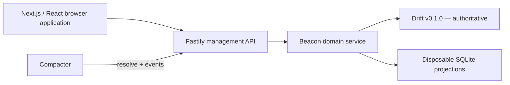

# Beacon Architecture

Beacon is the management boundary between Drift and Compactor.

The Next.js App Router produces a static React application that Fastify serves in production. Next's development server proxies API requests to Fastify and falls back to the root client application for editor routes. The browser application never receives Drift or Compactor credentials. Browser writes use a signed, same-site session cookie and origin checks. Compactor endpoints use separate fixed bearer credentials.

## Internal composition

The browser entrypoint coordinates only session state and screen selection. Individual screens own their workflows, reusable controls live in a shared component module, and formatting and form conversion remain independent from rendering.

The server exposes one small `BeaconService` facade to HTTP routes. Focused collaborators own administrator identity, redirect and destination catalog operations, Compactor integration, projection updates, projection rebuilding, and Drift-record mapping. The facade preserves a stable transport dependency without becoming a domain catch-all.

Redirect and destination vertices are joined by one `points_to` edge. Event and activity vertices are deliberately unconnected. All application writes commit to Drift before local projections. A failed projection update marks the read model stale and never reverses an authoritative mutation.

Resolution uses the canonical URL projection to locate a redirect, then rereads its vertex, edge, and destination from Drift. A projection miss triggers an authoritative scan and self-heal. This is the bounded v0.1.0 workaround for Drift's lack of exact slug/external-ID lookup.
